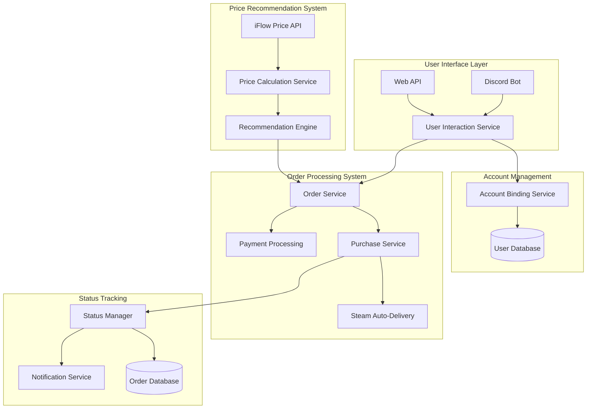
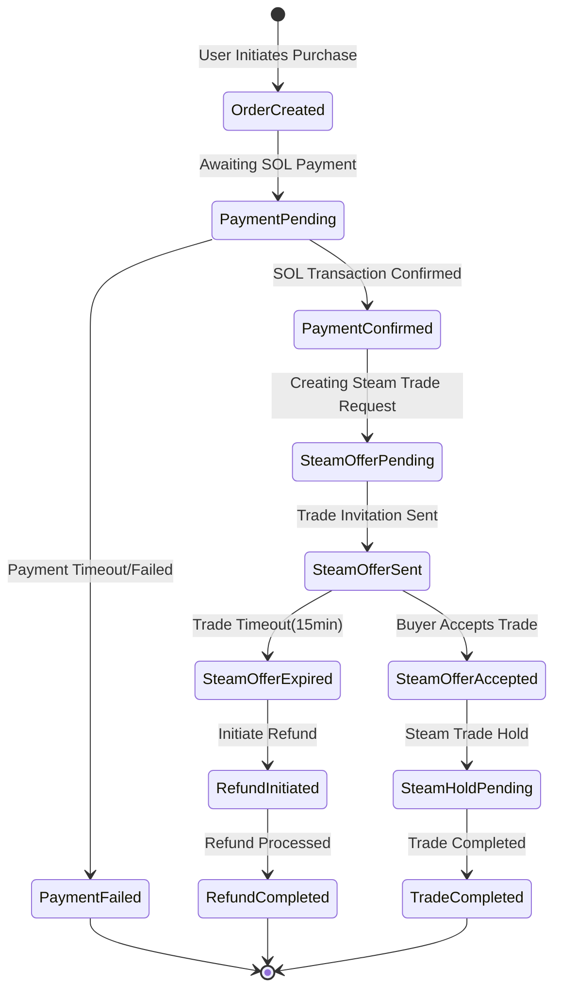

# 🎮 SteamPipe: AI-Powered CS2 Skin Trading Platform

<div align="center">
  <strong>Revolutionizing CS2 Skin Trading with AI and Solana</strong>
</div>

## 🚀 Overview

SteamPipe revolutionizes CS2 skin trading by combining AI-powered price analysis with Solana's high-performance blockchain. Our platform seamlessly integrates Steam's trading system with decentralized finance, providing a secure, efficient, and intelligent trading experience.

## 🔥 Core Innovation

Unlike traditional CS2 trading platforms, SteamPipe leverages:
- AI-driven price recommendations using the iFlow API
- Solana's high-speed, low-cost blockchain for settlements
- Multi-layer escrow system for secure trades
- Automated trade execution and verification

## 🏗️ System Architecture



## 📊 Trade Flow Management



## 🛠️ Technical Implementation

### 1. Smart Contract System

```rust
#[program]
pub mod steampipe {
    pub fn initialize_user(ctx: Context<InitializeUser>) -> Result<()> {
        let user = &mut ctx.accounts.user;
        user.owner = *ctx.accounts.owner.key;
        user.steam_id = String::new();
        user.steam_linked = false;
        user.trades_count = 0;
        Ok(())
    }

    pub fn create_listing(
        ctx: Context<CreateListing>,
        item_id: String,
        price: u64,
        item_name: String,
    ) -> Result<()> {
        let listing = &mut ctx.accounts.listing;
        listing.seller = *ctx.accounts.user.key;
        listing.item_id = item_id;
        listing.price = price;
        listing.state = ListingState::Active;
        Ok(())
    }

    // Additional contract functions...
}
```

### 2. Price Recommendation Engine

```typescript
class PriceRecommendationService {
    private readonly iFlowAPI: IFlowAPI;
    private readonly aiAgent: SolanaAgentKit;

    async getRecommendedPrice(itemId: string): Promise<PriceRecommendation> {
        const historicalData = await this.iFlowAPI.getHistoricalPrices(itemId);
        const marketTrends = await this.iFlowAPI.getMarketTrends();
        
        return this.aiAgent.analyzePriceData({
            historicalData,
            marketTrends,
            recentTrades: await this.getRecentTrades(itemId)
        });
    }
}
```

### 3. Trade Processing System

```typescript
class TradeProcessor {
    async processTrade(order: Order): Promise<TradeResult> {
        // 1. Validate Order
        await this.validateOrder(order);

        // 2. Create Escrow
        const escrow = await this.solanaService.createEscrow(order);

        // 3. Process Steam Trade
        const steamTrade = await this.steamService.createTradeOffer({
            partnerId: order.buyerId,
            items: order.items,
            tradeToken: order.tradeToken
        });

        // 4. Monitor Trade Status
        return this.monitorTradeCompletion(steamTrade.id, escrow.id);
    }
}
```

## 🔒 Security Architecture

### 1. Steam API Protection
```typescript
class SteamSecurityService {
    private readonly rateLimiter: RateLimiter;
    private readonly apiKeyManager: APIKeyManager;

    constructor() {
        // Implement rate limiting per API key
        this.rateLimiter = new RateLimiter({
            windowMs: 15 * 60 * 1000, // 15 minutes
            max: 100 // limit each IP to 100 requests per windowMs
        });

        // Rotate API keys periodically
        this.apiKeyManager = new APIKeyManager({
            rotationInterval: 24 * 60 * 60 * 1000, // 24 hours
            maxRequestsPerKey: 10000
        });
    }

    async validateTradeRequest(tradeRequest: TradeRequest): Promise<boolean> {
        // Implement multiple validation layers
        await this.validateSteamGuard(tradeRequest.steamGuard);
        await this.validateTradeUrl(tradeRequest.tradeUrl);
        await this.validateItemOwnership(tradeRequest.items);
        return true;
    }
}
```

### 2. Fraud Prevention System
```typescript
class FraudDetectionService {
    async analyzeTransaction(trade: Trade): Promise<RiskScore> {
        const riskFactors = await Promise.all([
            this.checkPriceManipulation(trade.price),
            this.checkUserHistory(trade.userId),
            this.checkItemProvenance(trade.itemId),
            this.checkTradePattern(trade.pattern)
        ]);

        return this.calculateRiskScore(riskFactors);
    }

    private async checkPriceManipulation(price: number): Promise<RiskFactor> {
        // Compare with historical data and market averages
        const marketPrice = await this.getPriceData(price);
        const deviation = Math.abs(price - marketPrice.average);
        
        return {
            risk: deviation > marketPrice.standardDeviation * 2 ? 'HIGH' : 'LOW',
            factor: 'PRICE_MANIPULATION'
        };
    }
}
```

### 3. Multi-Layer Trade Verification
- **Steam Guard Authentication**
  - Mobile authenticator verification
  - Device fingerprinting
  - Login pattern analysis

- **Solana Transaction Security**
  ```typescript
  class TransactionVerifier {
      async verifyTransaction(tx: Transaction): Promise<boolean> {
          // Verify signatures
          await this.verifySignatures(tx.signatures);
          
          // Verify account ownership
          await this.verifyAccountOwnership(tx.accounts);
          
          // Check transaction limits
          await this.checkTransactionLimits(tx.amount);
          
          return true;
      }
  }
  ```

### 4. Automated Safety Systems

1. **Real-time Monitoring**
   ```typescript
   interface MonitoringMetrics {
       tradeVolume: number;
       uniqueUsers: number;
       failedAttempts: number;
       averagePrice: number;
       suspiciousActivities: Activity[];
   }
   ```

2. **Risk Management**
   - Trade value limits
   - Account age requirements
   - Trading velocity checks
   - IP geolocation verification

3. **Account Protection**
   ```typescript
   interface AccountSecurity {
       steamGuardEnabled: boolean;
       lastLoginIP: string;
       loginHistory: LoginRecord[];
       tradeURLs: string[];
       apiKeyUsage: APIKeyMetrics;
   }
   ```

### 5. Emergency Response System

```typescript
class EmergencyHandler {
    async handleSecurityBreach(incident: SecurityIncident): Promise<void> {
        // 1. Freeze affected accounts
        await this.freezeAccounts(incident.affectedAccounts);
        
        // 2. Reverse recent transactions
        await this.reverseRecentTransactions(incident.timeFrame);
        
        // 3. Notify affected users
        await this.notifyUsers(incident.affectedUsers);
        
        // 4. Generate incident report
        await this.generateReport(incident);
    }
}
```

### 6. Regular Security Audits

1. **Smart Contract Audits**
   - Regular code reviews
   - Vulnerability assessments
   - Penetration testing

2. **API Security Reviews**
   - Rate limiting effectiveness
   - Authentication mechanisms
   - Access pattern analysis

3. **User Behavior Analysis**
   ```typescript
   interface UserBehaviorMetrics {
       tradingPattern: Pattern;
       loginLocations: Location[];
       deviceFingerprints: string[];
       riskScore: number;
   }
   ```

## 💫 Key Features

### 1. AI-Powered Trading
- Market trend analysis
- Price prediction models
- Risk assessment
- Fraud detection

### 2. Automated Trade Execution
- Smart contract-based escrow
- Instant settlements
- Error recovery
- Status tracking

### 3. User Protection
- Price verification
- Trade guarantees
- Dispute resolution
- Anti-scam measures

## 🚗 Development Roadmap

### Phase 1 (Completed)
- ✅ Smart contract development
- ✅ Steam integration
- ✅ Basic trading system
- ✅ Price tracking

### Phase 2 (Current)
- 🔄 AI integration
- 🔄 Advanced price predictions
- 🔄 Automated trading
- 🔄 Enhanced security

### Phase 3 (Planned)
- ⏳ Mobile app
- ⏳ Advanced analytics
- ⏳ Additional game support
- ⏳ Community features

## 🏗️ Quick Start

1. **Installation**
```bash
git clone https://github.com/yourusername/steampipe.git
cd steampipe
npm install
```

2. **Environment Setup**
```bash
# .env configuration
SOLANA_PRIVATE_KEY=xxx
STEAM_API_KEY=xxx
IFLOW_API_KEY=xxx
OPENAI_API_KEY=xxx
```

3. **Smart Contract Deployment**
```bash
anchor build
anchor deploy
```

4. **Run Development Server**
```bash
npm run dev
```

## 💻 API Examples

### Create Trade Order
```typescript
const order = await tradeService.createOrder({
    itemId: "AWP_Dragon_Lore",
    price: 1000,
    useAIPricing: true
});
```

### Monitor Trade Status
```typescript
const status = await tradeService.getTradeStatus(tradeId);
console.log(`Trade Status: ${status.state}`);
console.log(`Escrow Status: ${status.escrowState}`);
```

## 📄 License

This project is licensed under the MIT License - see the [LICENSE](LICENSE) file for details.
