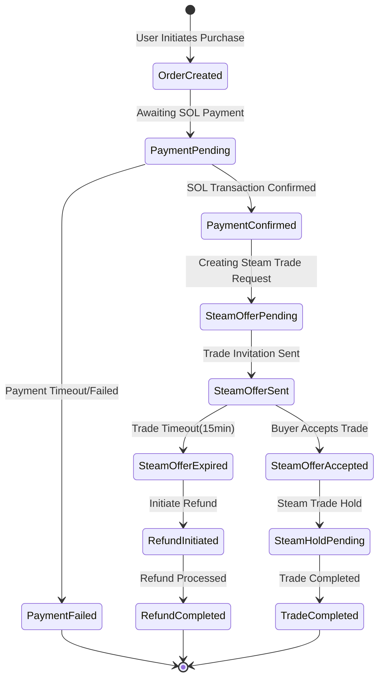
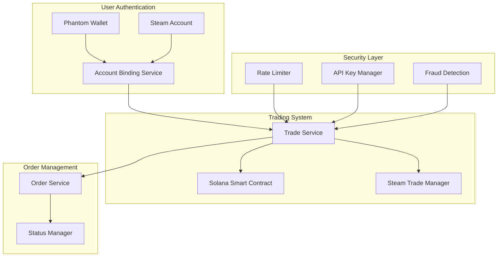

# 🎮 SteamPipe: AI-Powered CS2 Skin Trading Platform

<div align="center">
  <strong>Secure CS2 Skin Trading with Phantom Wallet and Solana</strong>
</div>

## 🚀 Overview

SteamPipe revolutionizes CS2 skin trading by integrating Solana's high-performance blockchain with Steam's trading system. Our platform ensures secure, efficient, and compliant trading through strict one-to-one binding between Phantom wallets and Steam accounts.

## 🔑 Core Features

### Secure Wallet Integration
- One-to-one binding between Phantom wallet and Steam account
- Secure trade URL validation and storage
- Automated Steam Guard verification

### Steam API Compliance
- Rate limiting per Steam's requirements (100k requests/day)
- Steam API key validation and secure storage
- Trade offer validation and verification

### Trading System


## 🏗️ System Architecture



## 💻 Technical Implementation

### 1. Wallet-Steam Binding
```typescript
interface AccountBinding {
    phantomWallet: string;
    steamId: string;
    tradeUrl: string;
    lastUsed: Date;
    requestCount: number;
}
```

### 2. Smart Contract System
```rust
#[program]
pub mod steampipe {
    pub fn initialize_trade(ctx: Context<InitializeTrade>, amount: u64) -> Result<()> {
        let trade = &mut ctx.accounts.trade;
        trade.buyer = ctx.accounts.buyer.key();
        trade.amount = amount;
        trade.state = TradeState::Created;
        Ok(())
    }
}
```

### 3. Rate Limiting and API Management
```typescript
class SteamAPIManager {
    private readonly MAX_REQUESTS_PER_DAY = 100000;
    private readonly REQUEST_WINDOW_MS = 24 * 60 * 60 * 1000;

    async validateRequest(binding: AccountBinding): Promise<boolean> {
        // Check and update rate limits
        if (binding.requestCount >= this.MAX_REQUESTS_PER_DAY) {
            throw new Error('API rate limit exceeded');
        }
        return true;
    }
}
```

## 🔒 Security Features

### 1. Account Protection
- Phantom wallet signature verification
- Steam Guard authentication
- Trade URL validation
- Rate limiting per account

### 2. Trade Security
- Escrow-based trading system
- Automated trade verification
- Fraud detection system
- Price manipulation prevention

### 3. API Security
- Steam API key rotation
- Request rate monitoring
- Secure key storage
- Access pattern analysis

## 🚀 Getting Started

1. **Prerequisites**
```bash
npm install @solana/web3.js @solana/wallet-adapter-phantom
```

2. **Connect Wallet**
```typescript
const connectWallet = async () => {
    // Check for Phantom Wallet
    const { solana } = window;
    if (!solana?.isPhantom) {
        throw new Error('Please install Phantom Wallet');
    }
    return await solana.connect();
};
```

3. **Bind Steam Account**
```typescript
const bindSteamAccount = async (
    phantomWallet: string,
    steamId: string,
    tradeUrl: string
) => {
    const response = await fetch('/api/bind-account', {
        method: 'POST',
        body: JSON.stringify({ phantomWallet, steamId, tradeUrl })
    });
    return await response.json();
};
```

## 📦 Development Setup

1. **Environment Configuration**
```bash
# .env configuration
SOLANA_RPC_URL=your_rpc_url
STEAM_API_KEY=your_api_key
```

2. **Install Dependencies**
```bash
npm install
```

3. **Run Development Server**
```bash
npm run dev
```

## 🔄 Trade Flow

1. **Initiate Trade**
   - Connect Phantom wallet
   - Verify Steam account binding
   - Select items for trade

2. **Execute Trade**
   - Create Solana transaction
   - Generate Steam trade offer
   - Monitor trade status

3. **Complete Trade**
   - Confirm item transfer
   - Release escrow
   - Update trade status

## 📄 License

This project is licensed under the MIT License - see the [LICENSE](LICENSE) file for details.
